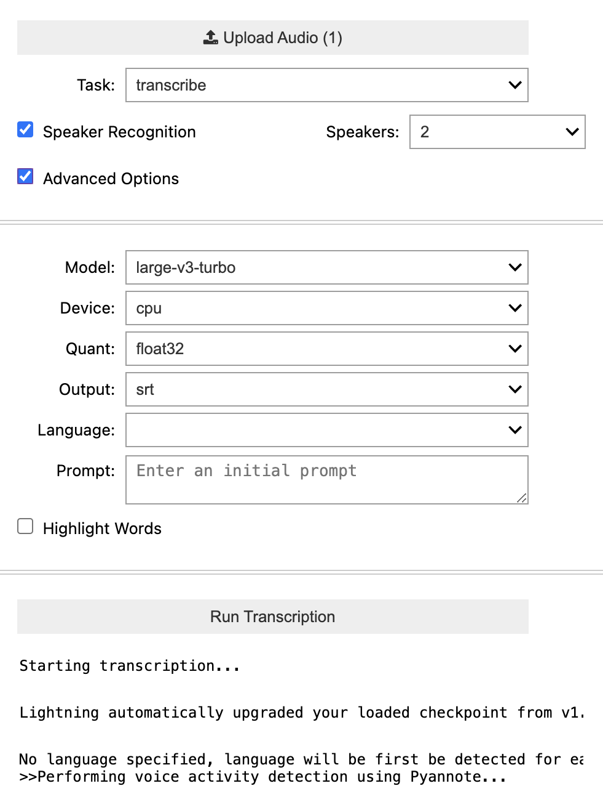

# whisperXapp
A simple interactive UX interface for whisperX using widgets in jupyter notebooks.



## Installation
``` bash
python3.11 -m venv venv3.11_whisperxapp
source venv3.11_whisperxapp/bin/activate
git clone --recursive https://github.com/Global-Health-Engineering/whisperXapp.git
cd whisperXapp
pip install -e whisperx/.
pip install ipykernel ipywidgets
ipython kernel install --user --name=venv3.11_whisperxapp
```